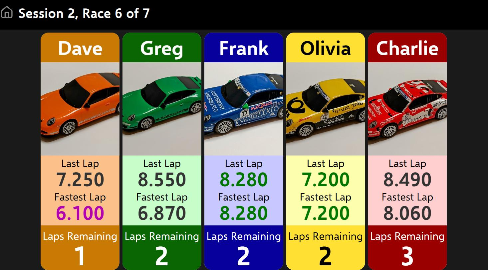
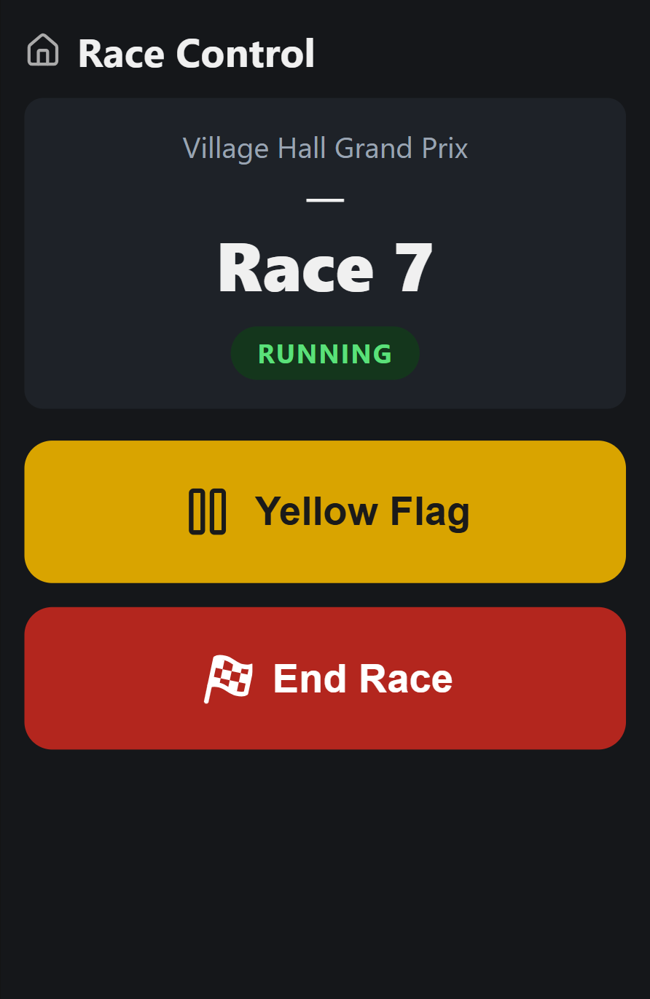

# Standalone Scalextric Digital Lap Counter

AKA: Lapcounter-Server - because it is capable of being used with other systems.

Lapcounter-Server is the software portion of a Scalextric Digital Race Management System.
A combination of hardware and software, which counts laps on a Scalextric Digital slot racing circuit.
It includes a real time leaderboard viewable in a web browser.

For more technical details, please see **readme.developer.md**, and for the full technical reference (MQTT contracts, database schema, race lifecycle) see **CLAUDE.md**.

## Hardware
A Raspberry Pi, plus a way to read each car's digital ID as it crosses the start/finish line. Two options, picked at deploy time — exactly one runs at a time, and everything above it (race management, the leaderboard) works identically either way:

* **Bluetooth LE** (the default on the live Pi) — talks directly to a Scalextric ARC Pro powerbase, reading all 6 digital car IDs over Bluetooth. No extra hardware beyond the powerbase you already have to run digital Scalextric.
* **GPIO** (the original hardware, still supported as a fallback) — a 2 lane car id sensor circuit created by [ZoomRoom](https://www.slotforum.com/members/zoomroom.24952/):
  * A Raspberry Pi 3A
  * Fitted into a 3D printed case clipped to the edge of a modified half straight track piece
    * which house optical sensors in each lane
    * The sensors are connected to a transistor circuit to amplify and clean up the edges of the signal
    * This optical signal feeds into a PIC microcontroller which converts the "PWM-ish" signal from the car's IR LED into numeric Card IDs 1-6
      * The carID of a car passing the sensor is sent to the Pi over a parallel 3 bit signal via the IO header pins

Either way: [Optional] A Wireless Access Point so that the whole system is standalone and transportable (i.e. it is not tied to your home WiFi, and can be run without any internet access)

## Software
The project upon which this is based, is well documented on [slotforum](https://www.slotforum.com/threads/wifi-raspberry-pi-based-lap-counter-timer.197059/). Whilst it was a great accomplishment during a few months of lockdown, I did dislike the UI. So, I developed my own ReactJs based front end. Once that was in a decent state, I reworked the backend so I could add features not possible with all the logic in the front end code: the race manager now runs server-side (in a container called `lapdata`), race meets/sessions/drivers are persisted in a PostgreSQL database, and React is a pure display and control layer that talks to it all over MQTT — so a browser refresh, or even nobody watching at all, no longer loses the current race.

The leaderboard (`/currentrace`, meant for a TV or big screen — real driver names, car
images and colours matching the powerbase, live lap times, fastest lap of the race
highlighted in purple):

Race control (`/racecontrol`, meant for the operator's phone — start/end a race, trigger
a yellow flag):

## Features

* Nice fonts, and nice colours which map to the powerbase/hand throttle colours (hackable)
* F1 style start lights, with additional beep countdown
* Drivers only appear on the leaderboards when they first cross the line, so the screen looks uncluttered if only 2 drivers are racing
* Once the winning driver crosses the line, each driver finishes their lap, then the race is over
    * This can give some odd looking ordering of finishing events, where results can appear out of position order as drivers one or more laps behind finish their own last lap after the leader already has.
    * The logic is correct, as is based on a greater number of laps completed beats less laps completed, and for drivers on the same lap, lower total race time beats higher total race time
* Two race types — Finishing Position (fixed lap count) and Fastest Lap (fixed time, ranked by personal best) — because I got tired of drivers debating whether to run a 20 or 25 lap race. Each is kept substantially different from the other, with choices intentionally limited (but can be hacked)
* Yellow flag, triggered from the operator's race control page (`/racecontrol`), not a keyboard shortcut on the display screen
    * A grace period (a few seconds, configurable per session) lets everyone finish the corner and get clear — laps still count during it, since the cars are still under power and still racing
    * On a Bluetooth LE powerbase, power is genuinely cut to every car once the grace period ends, so the field actually stops — no more "sneaky driver keeps going" advantage
    * On the older GPIO hardware there's no way to cut power at all, so a yellow flag there is bookkeeping only: it still hides positions and stops counting laps, just without physically stopping any cars
    * The operator can end the yellow flag early ("Resume Now"), or the race can finish during the grace period like any other lap
* Full race meet management: meetings, sessions and drivers are all persisted, not just the one race on screen
    * A session runs a whole queue of races back-to-back, automatically balanced so every driver races the same number of times and rotates through lanes fairly
    * An operator can pull a driver from one race without losing their place in the rest of the session (with a configurable limit on how many times before a "disqualify from the rest of the session?" prompt appears)
    * Results and lap history are kept per session, for after-the-meet analysis
* Driver with fastest lap of the race has their fastest lap time shown in purple
* Driver names quickly editable (not shown)
* Previously uploaded car images can be quickly selected
* [Coming Soon] A nice UI for uploading the car images

## Future Enhancements

see GitHub Issues

### For Reference

Ian Harding's (MIH) (electricimage.co.nz) was instrumental in the hardware and firmware needed to read the car id using photodiode and PIC firmware. The original documentation is on the wayback machine here: https://web.archive.org/web/20130223083727/http://electricimages.co.nz/(S(zhq2bk45stttoryfmacfyrfs))/SSD_Decoder.ashx

All pages on the electricimages website, indexed here: https://web.archive.org/web/20130222223536/http://electricimages.co.nz/(S(zhq2bk45stttoryfmacfyrfs))/AllPages.aspx
This is still an amazing resource
